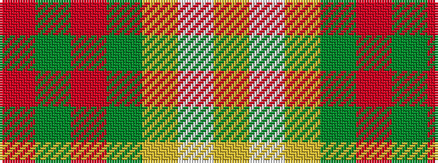

RGRGYWY

It is a 7 stripe tartan.

<figure class="pat-woven">

<figcaption>idealised sample</figcaption>
</figure>

## Colour Sequence



## Tartans with this colour sequence

| Tartans |
|---------------|
| [Claus of the North Pole (Restricted)](/variants/s7/r21g3r21g16lo3w2lo3~x2/)|
||
