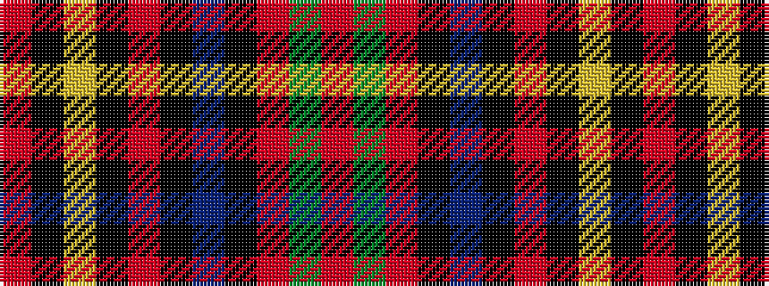

RGRKBKRKYKR

It is a 11 stripe tartan.

<figure class="pat-woven">

<figcaption>idealised sample</figcaption>
</figure>

## Colour Sequence



## Tartans with this colour sequence

| Tartans |
|---------------|
| [O'Malley (Name?)](/setts/s11/r45k3ly4k3r45k1dp2k1r2g8r2~x2/)|
||
