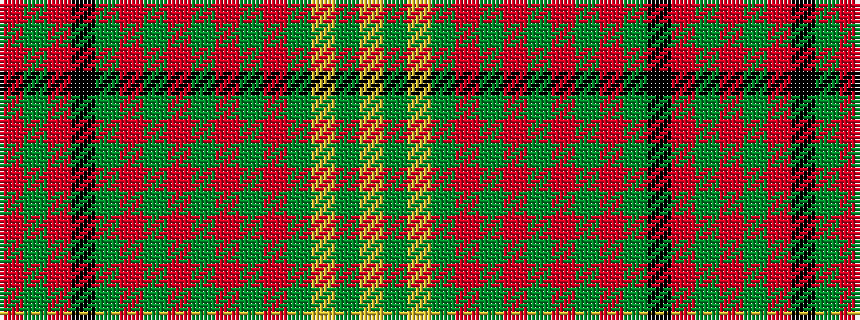

RGRKGRGRGRGRGYGY

It is a 16 stripe tartan.

<figure class="pat-woven">

<figcaption>idealised sample</figcaption>
</figure>

## Colour Sequence



## Tartans with this colour sequence

| Tartans |
|---------------|
| [Brian Boru 2014](/variants/s16/r4y2r24k1y8r2y1r2y4r2y1r2y16ly2y1ly4~x2/)|
||
