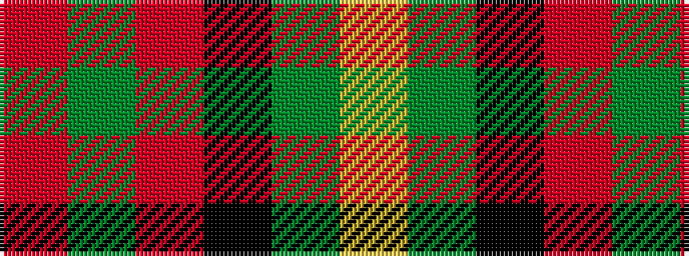

RGRKGY

It is a 6 stripe tartan.

<figure class="pat-woven">

<figcaption>idealised sample</figcaption>
</figure>

## Colour Sequence



## Tartans with this colour sequence

| Tartans |
|---------------|
| [Wolves Wod Kindred](/variants/s6/o2dg2r9k9g2ly2~x4/)|
||
