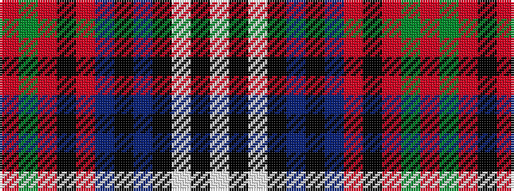

RGRKRBKBKWKW

It is a 12 stripe tartan.

<figure class="pat-woven">

<figcaption>idealised sample</figcaption>
</figure>

## Colour Sequence



## Tartans with this colour sequence

| Tartans |
|---------------|
| [Niagara Region](/setts/s12/w4k2w2k28dt4k2dt2r1k13r1dg13r2~x2/)|
||
