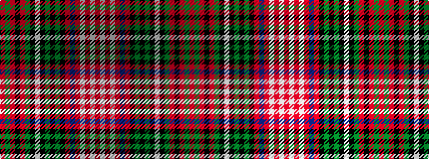

RGRKRGKWKGKGKRBRWRWR

It is a 20 stripe tartan.

<figure class="pat-woven">

<figcaption>idealised sample</figcaption>
</figure>

## Colour Sequence



## Tartans with this colour sequence

This pattern is a design lineage: every tartan below shares one colour order, whatever its owner —
near-identical designs are grouped, the largest lineage first (#112: the pattern is a tartan's
second parent, beside its family or clan).

<table class="sett-table">
<tbody>
<tr><td><a href="/variants/s20/r8lb10r4lb14r8db10r5k9y4k4y4k7w8k8g36r2k4r2g8r6/">Anderson of Kinnedar, hunting</a></td></tr>
<tr><td class="sett-swatch"></td></tr>
<tr><td><a href="/variants/s20/r4lb5r2lb7r4db5r3k5dy2k3dy2k4w4k4g18r1k2r1g4r3~x2/">Anderson of Kinneddar Hunting</a></td></tr>
<tr><td class="sett-swatch"></td></tr>
</tbody>
</table>

