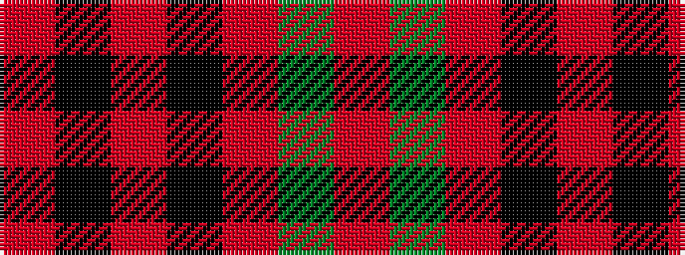

RGRKRKR

It is a 7 stripe tartan.

<figure class="pat-woven">

<figcaption>idealised sample</figcaption>
</figure>

## Colour Sequence



## Tartans with this colour sequence

| Tartans |
|---------------|
| [MacKintosh #5](/setts/s7/r75dg12r3k2r2k2r36~x2/)|
||
| [MacKintosh 4](/setts/s7/r75g12r3k2r2k2r36~x2/)|
||
| [MacQuarrie #7](/setts/s7/r4dg5r2k6r18k2r4~x2/)|
||
| [MacQuarrie 5](/setts/s7/r4g5r2k6r18k2r4~x2/)|
||
