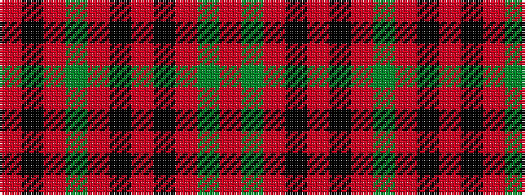

RGRKRKRGRKR

It is a 11 stripe tartan.

<figure class="pat-woven">

<figcaption>idealised sample</figcaption>
</figure>

## Colour Sequence



## Tartans with this colour sequence

| Tartans |
|---------------|
| [MacDonell of Keppach](/setts/s11/r9dg4r6k2r4k2r8dg14r24k2r4~x2/)|
||
| [MacDonell of Keppach](/setts/s11/r9g4r6k2r4k2r8g14r24k2r4~x2/)|
||
