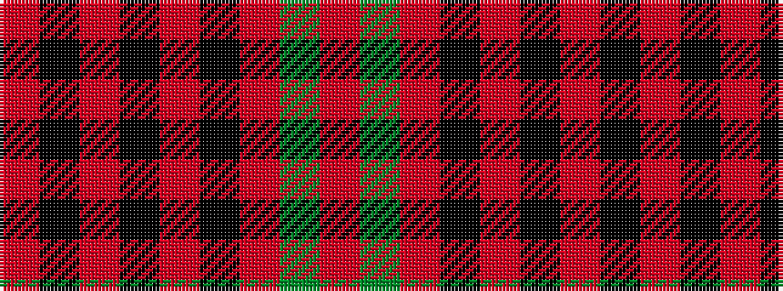

RGRKRKRKR

It is a 9 stripe tartan.

<figure class="pat-woven">

<figcaption>idealised sample</figcaption>
</figure>

## Colour Sequence



## Tartans with this colour sequence

| Tartans |
|---------------|
| [Knockando Woolmill](/setts/s9/oii16k1oi7k1oi7k1oii7dy24o4~x2/)|
||
