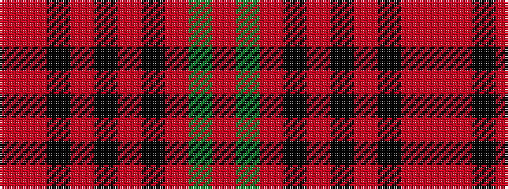

RGRKRKRKRR

It is a 10 stripe tartan.

<figure class="pat-woven">

<figcaption>idealised sample</figcaption>
</figure>

## Colour Sequence



## Tartans with this colour sequence

| Tartans |
|---------------|
| [Galway](/variants/s10/r4g13r3k4r3k3r40k4r2o4~x2/)|
||
