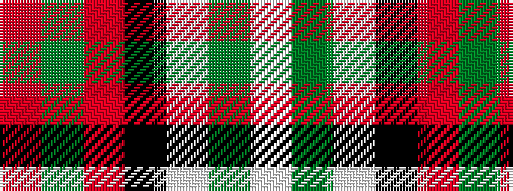

RGRKWGW

It is a 7 stripe tartan.

<figure class="pat-woven">

<figcaption>idealised sample</figcaption>
</figure>

## Colour Sequence



## Tartans with this colour sequence

| Tartans |
|---------------|
| [Bull-Dog Sauce](/setts/s7/w20g2w20k8r20g3r2~x2/)|
||
