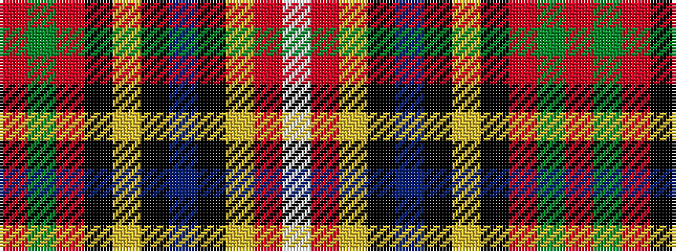

RGRKYKBKYRW

It is a 11 stripe tartan.

<figure class="pat-woven">

<figcaption>idealised sample</figcaption>
</figure>

## Colour Sequence



## Tartans with this colour sequence

| Tartans |
|---------------|
| [Mars (Personal)](/variants/s11/r16g16r8k8ly3k3db3k3ly3r14w3~x2/)|
||
| [Mars Family Tartan](/variants/s11/r16g16r8k8lo3k3db3k3lo3r14w3~x2/)|
||
