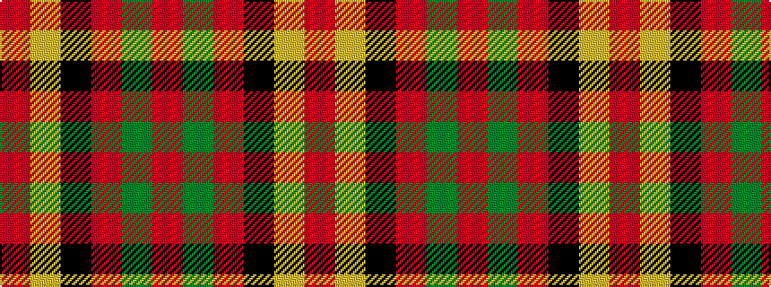

RGRKYR

It is a 6 stripe tartan.

<figure class="pat-woven">

<figcaption>idealised sample</figcaption>
</figure>

## Colour Sequence



## Tartans with this colour sequence

| Tartans |
|---------------|
| [Victoria, City of (British Columbia)](/setts/s6/r5g2ri2k2lo7r2~x4/)|
||
