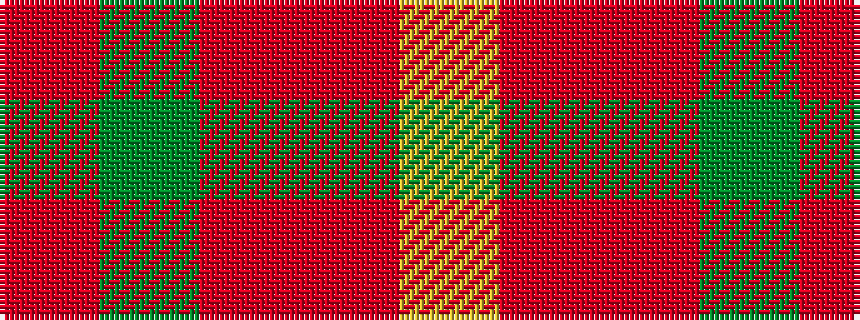

RGRRY

It is a 5 stripe tartan.

<figure class="pat-woven">

<figcaption>idealised sample</figcaption>
</figure>

## Colour Sequence



## Tartans with this colour sequence

| Tartans |
|---------------|
| [Ballantyne Personal Tartan](/variants/s5/o60dg13o9oi8ly4~x2/)|
||
