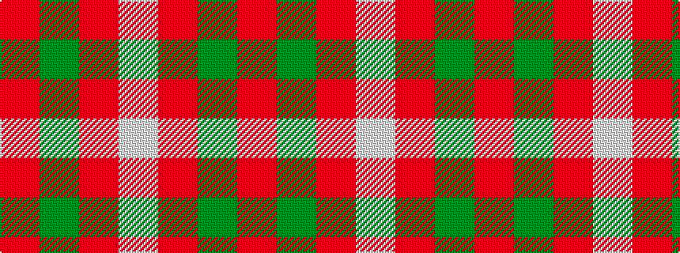

RGRW

It is a 4 stripe tartan.

<figure class="pat-woven">

<figcaption>idealised sample</figcaption>
</figure>

## Colour Sequence



## Tartans with this colour sequence

| Tartans |
|---------------|
| [MacKinnon #6](/variants/s4/r3dg20r25w3~x4/)|
||
| [MacKinnon 11](/variants/s4/r3g20r25w3~x4/)|
||
| [MacKinnon, hunting](/variants/s4/r1g8o8w1~x2/)|
||
