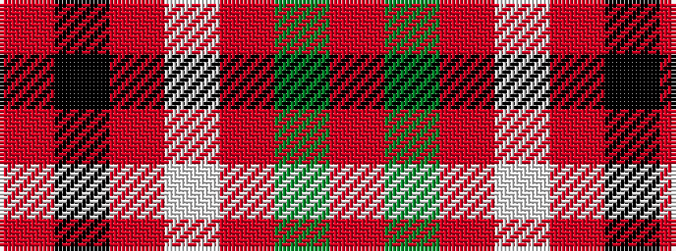

RGRWRKR

It is a 7 stripe tartan.

<figure class="pat-woven">

<figcaption>idealised sample</figcaption>
</figure>

## Colour Sequence



## Tartans with this colour sequence

| Tartans |
|---------------|
| [Rannoch Red](/variants/s7/r10y3r24lb3r16k3r8~x2/)|
||
