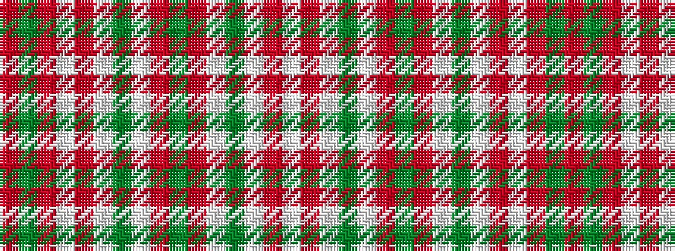

RGRWRWGWRGRWGWRW

It is a 16 stripe tartan.

<figure class="pat-woven">

<figcaption>idealised sample</figcaption>
</figure>

## Colour Sequence



## Tartans with this colour sequence

| Tartans |
|---------------|
| [Sekai Fushigi Hakken](/setts/s16/w18rii2w3dg2w27ri3dg2r3w27dg2w3rii2w18r3dg2ri3~x2/)|
||
