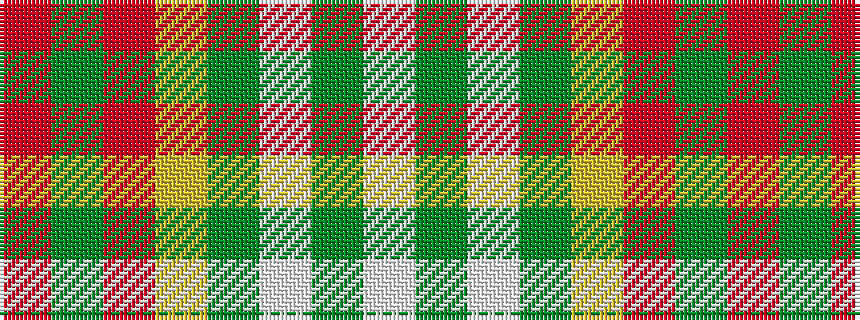

RGRYGWGW

It is a 8 stripe tartan.

<figure class="pat-woven">

<figcaption>idealised sample</figcaption>
</figure>

## Colour Sequence



## Tartans with this colour sequence

| Tartans |
|---------------|
| [Sutherland de Albergaria Dress (Personal)](/variants/s8/w5dg1w1dg33ly3r24dg3r4~x2/)|
||
