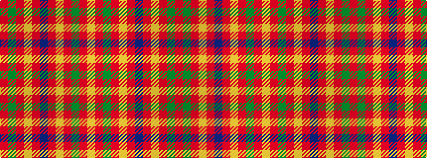

RGRYRBRYRGRY

It is a 12 stripe tartan.

<figure class="pat-woven">

<figcaption>idealised sample</figcaption>
</figure>

## Colour Sequence



## Tartans with this colour sequence

| Tartans |
|---------------|
| [Wilson's No.213](/variants/s12/r3dg14r3ly1r3dp8r3ly1r3dg14r3ly1~x4/)|
||
