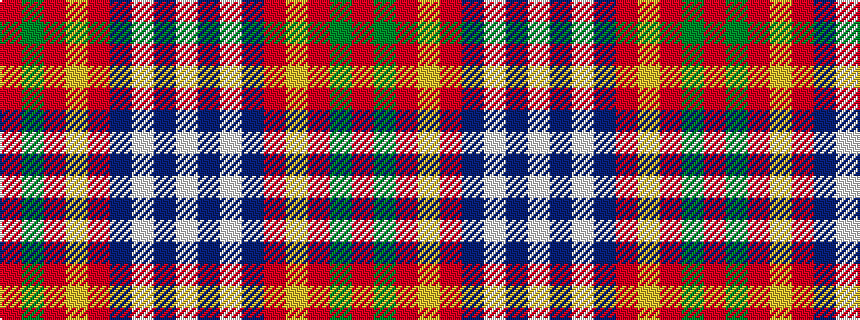

RGRYRBWBW

It is a 9 stripe tartan.

<figure class="pat-woven">

<figcaption>idealised sample</figcaption>
</figure>

## Colour Sequence



## Tartans with this colour sequence

| Tartans |
|---------------|
| [Russian Scottish](/variants/s9/w3b2w2b40r3ly1r10g10r1~x2/)|
||
| [Russian Scottish (District)](/variants/s9/w2db2w1db40r3ly1r10g10r1~x2/)|
||
