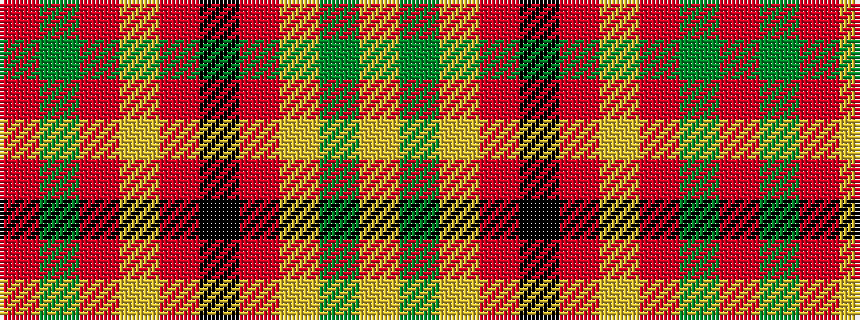

RGRYRKRYGY

It is a 10 stripe tartan.

<figure class="pat-woven">

<figcaption>idealised sample</figcaption>
</figure>

## Colour Sequence



## Tartans with this colour sequence

| Tartans |
|---------------|
| [Stirling & Bannockburn (District)](/setts/s10/r3g18r4lg3r4k13r3lg18g2ly3~x2/)|
||
