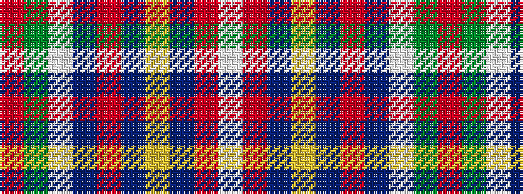

RGWBRBYBRW

It is a 10 stripe tartan.

<figure class="pat-woven">

<figcaption>idealised sample</figcaption>
</figure>

## Colour Sequence



## Tartans with this colour sequence

| Tartans |
|---------------|
| [State Seal of Texas (Fashion)](/variants/s10/r5g25lb3b5o15b5lo3b44o1lb4~x2/)|
||
