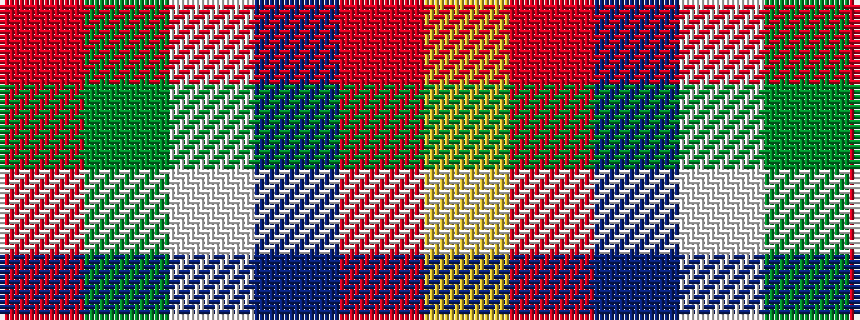

RGWBRY

It is a 6 stripe tartan.

<figure class="pat-woven">

<figcaption>idealised sample</figcaption>
</figure>

## Colour Sequence



## Tartans with this colour sequence

| Tartans |
|---------------|
| [McCartney (2015)](/variants/s6/r5g3lb3db5r16ly3~x2/)|
||
