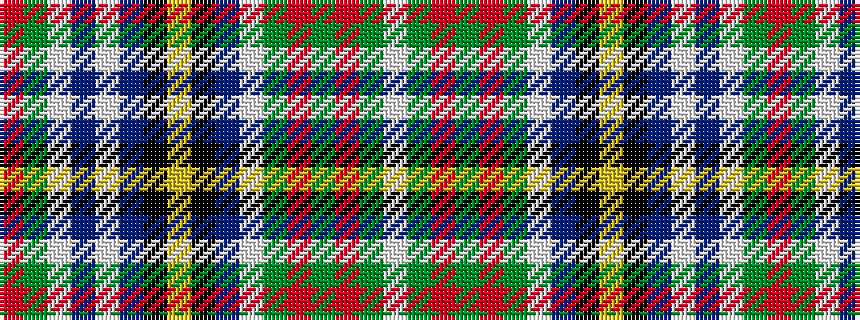

RGWBWBKYKBWGRGRGW

It is a 17 stripe tartan.

<figure class="pat-woven">

<figcaption>idealised sample</figcaption>
</figure>

## Colour Sequence



## Tartans with this colour sequence

| Tartans |
|---------------|
| [Victoria](/setts/s17/r4g1w19db4w4db1k5ly3k2db1w4g15r6g3r5g1w3~x2/)|
||
