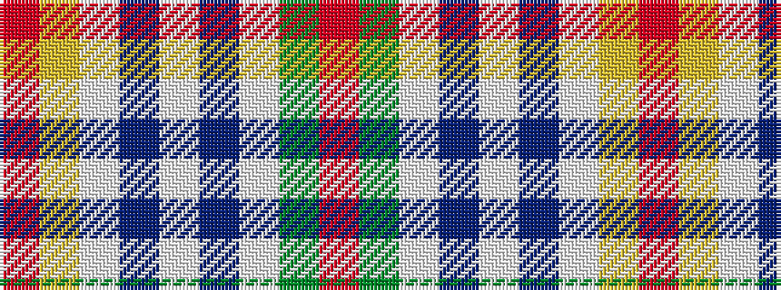

RGWBWBWYR

It is a 9 stripe tartan.

<figure class="pat-woven">

<figcaption>idealised sample</figcaption>
</figure>

## Colour Sequence



## Tartans with this colour sequence

| Tartans |
|---------------|
| [Rosevear](/setts/s9/r50ly4w16db2w4db2w15g27r4~x2/)|
||
| [Rosevear](/setts/s9/m50ly4w16db2w4db2w15g27r4~x2/)|
||
