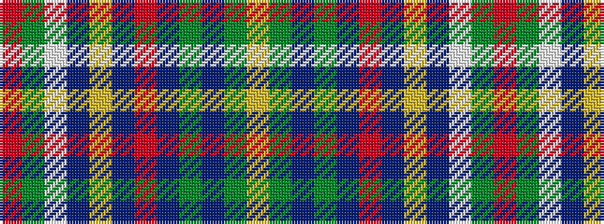

RGWBYBRBGBGY

It is a 12 stripe tartan.

<figure class="pat-woven">

<figcaption>idealised sample</figcaption>
</figure>

## Colour Sequence



## Tartans with this colour sequence

| Tartans |
|---------------|
| [Barcelona English School](/tartans/o52g3w3db3ly3db2r3db12g8db2g6ly4/)|
||
