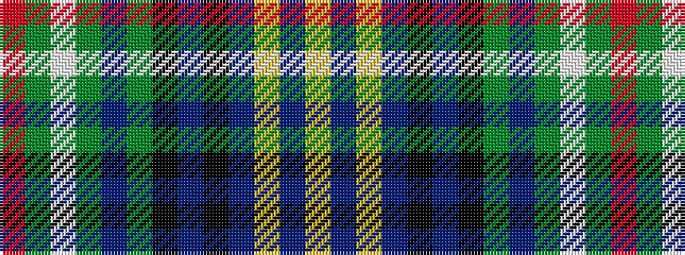

RGWGBGKBKBYBY

It is a 13 stripe tartan.

<figure class="pat-woven">

<figcaption>idealised sample</figcaption>
</figure>

## Colour Sequence



## Tartans with this colour sequence

| Tartans |
|---------------|
| [U.S. Ancient Order of Hibernians (Co](/setts/s13/r3g2w2g3db3g20k20db2k2db2lo15db3lo3~x2/)|
||
