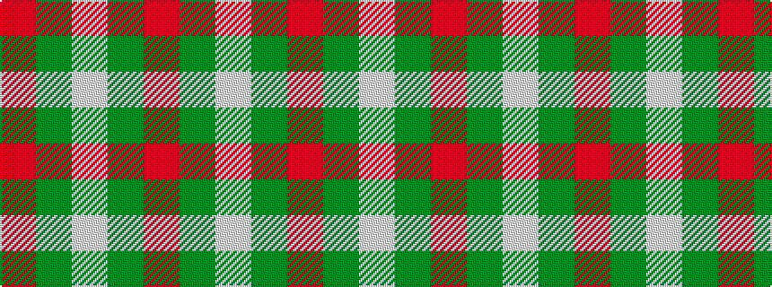

RGWGR

It is a 5 stripe tartan.

<figure class="pat-woven">

<figcaption>idealised sample</figcaption>
</figure>

## Colour Sequence



## Tartans with this colour sequence

| Tartans |
|---------------|
| [MacNab - 1800 (Portrait)](/variants/s5/r96g3lb3g6ri95/)|
||
