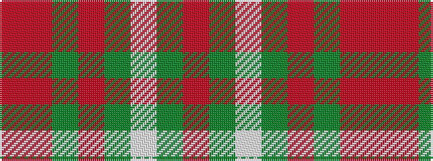

RGWGRGRR

It is a 8 stripe tartan.

<figure class="pat-woven">

<figcaption>idealised sample</figcaption>
</figure>

## Colour Sequence



## Tartans with this colour sequence

| Tartans |
|---------------|
| [Scott, hunting](/setts/s8/r3o14g8r2g2w2g2r1~x2/)|
||
