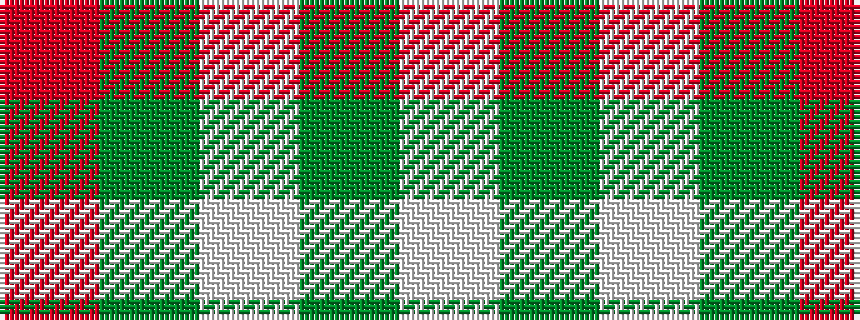

RGWGW

It is a 5 stripe tartan.

<figure class="pat-woven">

<figcaption>idealised sample</figcaption>
</figure>

## Colour Sequence



## Tartans with this colour sequence

| Tartans |
|---------------|
| [Coca Cola](/setts/s5/w7dy7w7dy40r3~x2/)|
||
| [Coca Cola (Corporate)](/setts/s5/w15dy15w15dy80r6/)|
||
