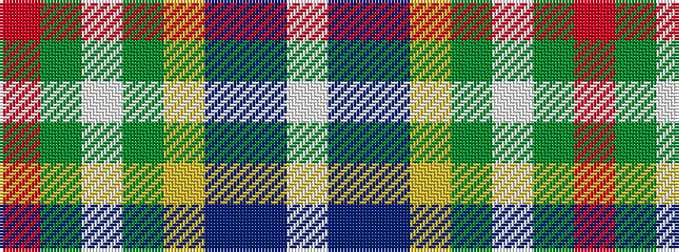

RGWGYBBW

It is a 8 stripe tartan.

<figure class="pat-woven">

<figcaption>idealised sample</figcaption>
</figure>

## Colour Sequence



## Tartans with this colour sequence

| Tartans |
|---------------|
| [Queensland](/setts/s8/w18t22db15ly6g10lp5g6r5~x2/)|
||
| [Queensland (District)](/setts/s8/w3t4db3ly1g2lp1g1m1~x12/)|
||
