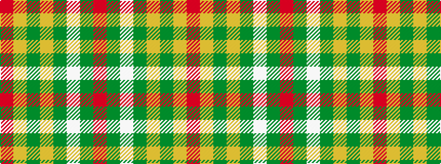

RGWGYGYR

It is a 8 stripe tartan.

<figure class="pat-woven">

<figcaption>idealised sample</figcaption>
</figure>

## Colour Sequence



## Tartans with this colour sequence

| Tartans |
|---------------|
| [Duke of Sussex (Earl of Inverness)](/variants/s8/r114g10w3g16ly3g3ly3r28~x2/)|
||
