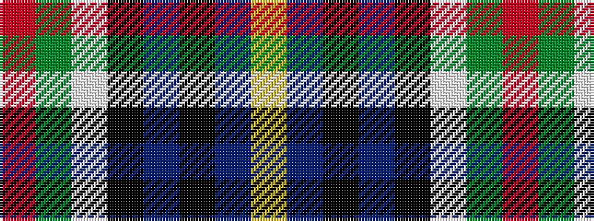

RGWKBKBY

It is a 8 stripe tartan.

<figure class="pat-woven">

<figcaption>idealised sample</figcaption>
</figure>

## Colour Sequence



## Tartans with this colour sequence

| Tartans |
|---------------|
| [Cowan of Inveresk (Personal)](/setts/s8/r4dg16w2k15db15k2db2ly2~x2/)|
||
| [Cowan, of Inveresk](/setts/s8/r4g16w2k15db15k2db2ly2~x2/)|
||
