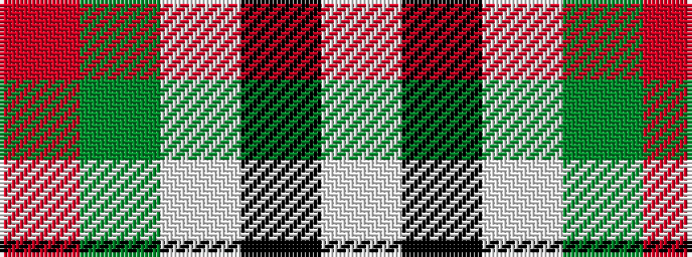

RGWKW

It is a 5 stripe tartan.

<figure class="pat-woven">

<figcaption>idealised sample</figcaption>
</figure>

## Colour Sequence



## Tartans with this colour sequence

| Tartans |
|---------------|
| [SAL Cubiska Stenen](/setts/s5/r15g3w2k10w5~x2/)|
||
