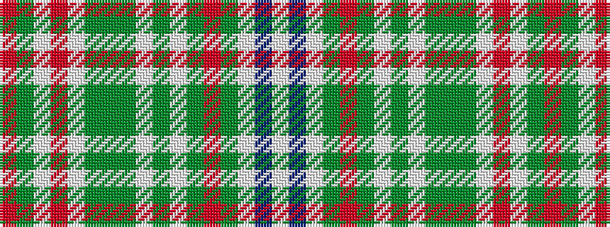

RGWRWGGGWGWGRGWBW

It is a 17 stripe tartan.

<figure class="pat-woven">

<figcaption>idealised sample</figcaption>
</figure>

## Colour Sequence



## Tartans with this colour sequence

| Tartans |
|---------------|
| [Jacobite Dress](/setts/s17/r16dy4w6r6w20dy15dg4dy15w1dy3w1dy5r6dg4w3db3w3~x2/)|
||
