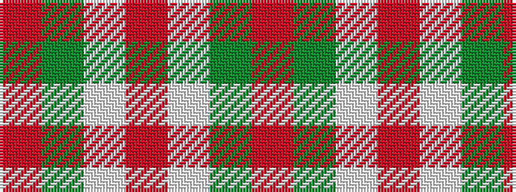

RGWRWGR

It is a 7 stripe tartan.

<figure class="pat-woven">

<figcaption>idealised sample</figcaption>
</figure>

## Colour Sequence



## Tartans with this colour sequence

| Tartans |
|---------------|
| [Pride of Cleveland Fall](/variants/s7/r17dy5w1r5w7dy47r7~x2/)|
||
