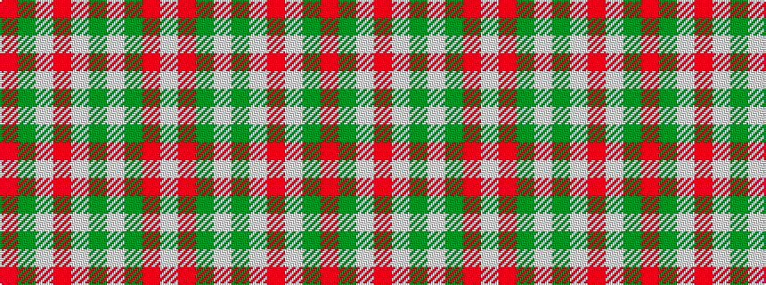

RGWRWGWGRW

It is a 10 stripe tartan.

<figure class="pat-woven">

<figcaption>idealised sample</figcaption>
</figure>

## Colour Sequence



## Tartans with this colour sequence

| Tartans |
|---------------|
| [Hose](/setts/s10/r2g2w2r23w2g2w23g2r2w2~x2/)|
||
| [Hose](/setts/s10/r2dg2w2r23w2dg2w23dg2r2w2~x2/)|
||
