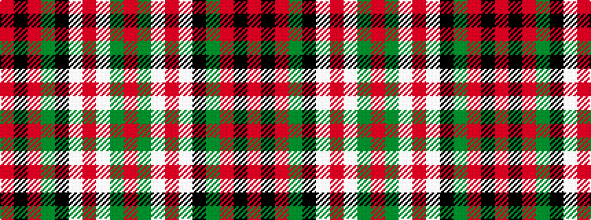

RGWRWKGRKR

It is a 10 stripe tartan.

<figure class="pat-woven">

<figcaption>idealised sample</figcaption>
</figure>

## Colour Sequence



## Tartans with this colour sequence

| Tartans |
|---------------|
| [MacDuff Dress #3](/variants/s10/r6dg3w22r5w5k9dg16r4k1r4~x2/)|
||
| [MacDuff, dress](/variants/s10/r6g3w22r5w5k9g16r4k1r4~x2/)|
||
