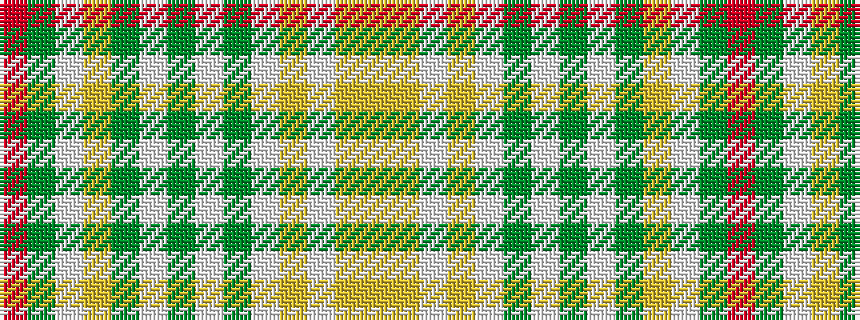

RGWYGWGWGWYWYY

It is a 14 stripe tartan.

<figure class="pat-woven">

<figcaption>idealised sample</figcaption>
</figure>

## Colour Sequence



## Tartans with this colour sequence

| Tartans |
|---------------|
| [Glen Forest](/setts/s14/o10dy5lb8lo8dy5lb8dy14lb4dy5lb4lo5lb4lo4ly10/)|
||
