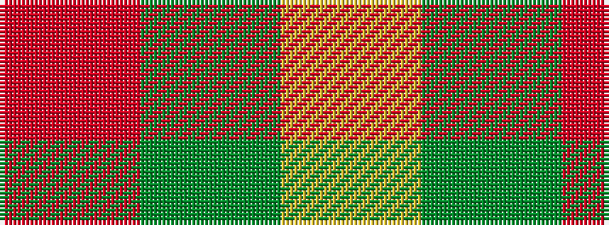

RGY

It is a 3 stripe tartan.

<figure class="pat-woven">

<figcaption>idealised sample</figcaption>
</figure>

## Colour Sequence



## Tartans with this colour sequence

| Tartans |
|---------------|
| [Scottish Watch](/setts/s3/r104g39ly4/)|
||
| [Scottish Watch (Corporate)](/setts/s3/r104dg39lo4~x2/)|
||
