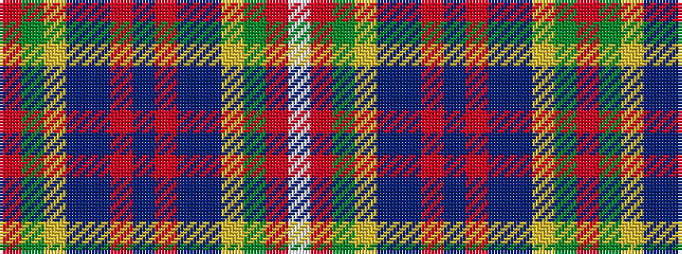

RGYBBRBRBBYGRW

It is a 14 stripe tartan.

<figure class="pat-woven">

<figcaption>idealised sample</figcaption>
</figure>

## Colour Sequence



## Tartans with this colour sequence

| Tartans |
|---------------|
| [Wilson's No.002](/setts/s14/r21g13ly2dp11t9r11dp2r11t9dp11ly2g13r21w1~x2/)|
||
