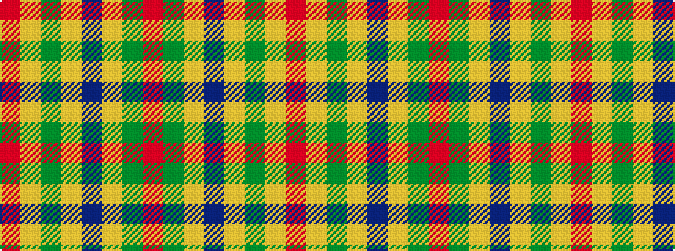

RGYBYGYR

It is a 8 stripe tartan.

<figure class="pat-woven">

<figcaption>idealised sample</figcaption>
</figure>

## Colour Sequence



## Tartans with this colour sequence

| Tartans |
|---------------|
| [Invertere (Daks #1) (Fashion)](/variants/s8/m3dg6lo2db2lo11dg2lo2m3~x2/)|
||
