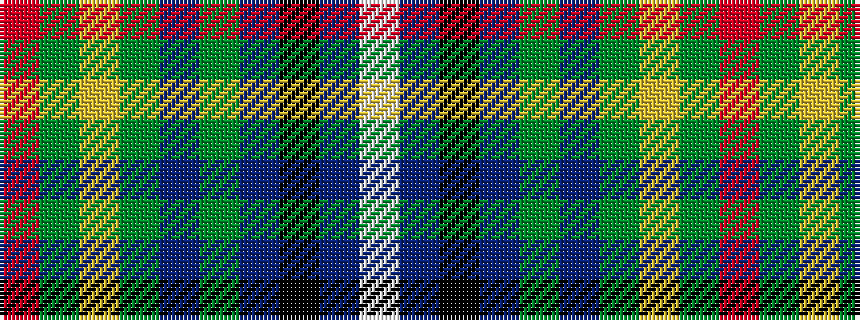

RGYGBGBKBW

It is a 10 stripe tartan.

<figure class="pat-woven">

<figcaption>idealised sample</figcaption>
</figure>

## Colour Sequence



## Tartans with this colour sequence

| Tartans |
|---------------|
| [Sarasota - Dunfermline (Commemorat)](/variants/s10/r2g6ly2g3b4g14b36k2b3w2~x2/)|
||
