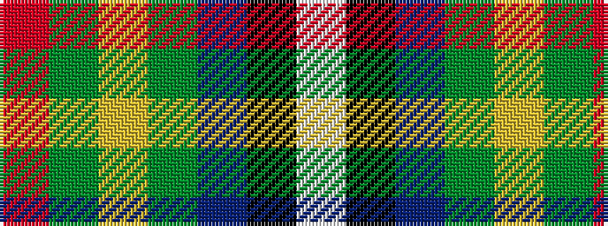

RGYGBKW

It is a 7 stripe tartan.

<figure class="pat-woven">

<figcaption>idealised sample</figcaption>
</figure>

## Colour Sequence



## Tartans with this colour sequence

| Tartans |
|---------------|
| [Harvey of Cornwall (Personal)](/variants/s7/w10k52db52dg24ly10dg5r5/)|
||
