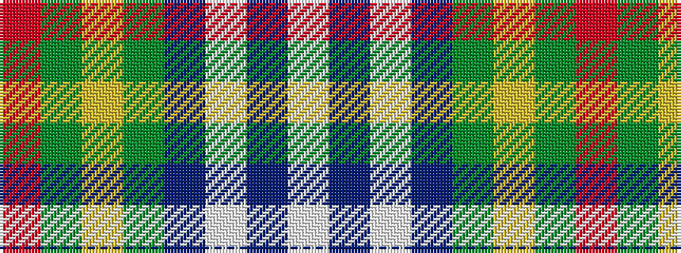

RGYGBWBW

It is a 8 stripe tartan.

<figure class="pat-woven">

<figcaption>idealised sample</figcaption>
</figure>

## Colour Sequence



## Tartans with this colour sequence

| Tartans |
|---------------|
| [Sandelin #2 (Personal)](/setts/s8/w10db2w1db35dg10lo3dg10r4~x2/)|
||
| [Sandelin (Personal)](/setts/s8/w10db2w1db35g10lo3g10r4~x2/)|
||
