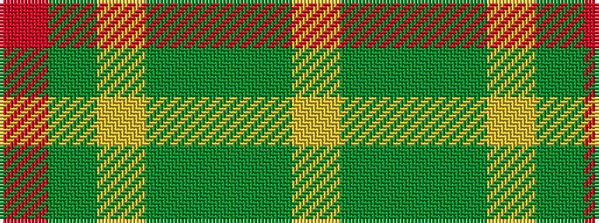

RGYGGGY

It is a 7 stripe tartan.

<figure class="pat-woven">

<figcaption>idealised sample</figcaption>
</figure>

## Colour Sequence



## Tartans with this colour sequence

| Tartans |
|---------------|
| [Devon, Green (District)](/variants/s7/o5y4lr1y4dy4dg4ly1~x4/)|
||
