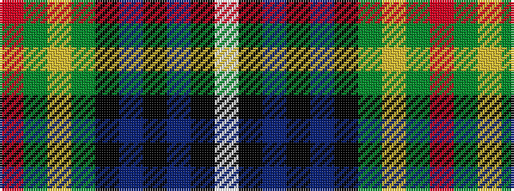

RGYGKBKBKW

It is a 10 stripe tartan.

<figure class="pat-woven">

<figcaption>idealised sample</figcaption>
</figure>

## Colour Sequence



## Tartans with this colour sequence

| Tartans |
|---------------|
| [McMeeken (Name)](/setts/s10/r7g20ly2g4k5b4k2b20k3w1~x2/)|
||
