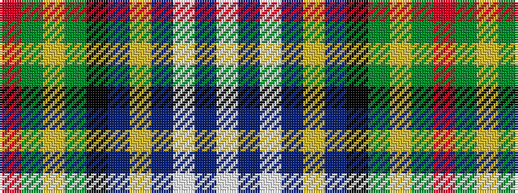

RGYGKBYBWBW

It is a 11 stripe tartan.

<figure class="pat-woven">

<figcaption>idealised sample</figcaption>
</figure>

## Colour Sequence



## Tartans with this colour sequence

| Tartans |
|---------------|
| [Pringle](/variants/s11/r4dg64ly4dg4k6db4ly4db56w4db4w1/)|
||
| [Pringle (Personal)](/variants/s11/r3dg32lo2dg2k3dt2lo2dt28lb2dt2lb3~x2/)|
||
| [Pringle Personal Tartan](/variants/s11/r2dg32ly2dg2k3db2ly2db28w2db2w2~x2/)|
||
