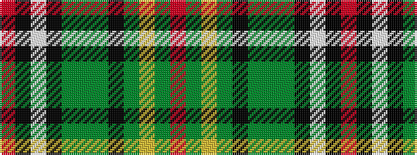

RGYGKGGGKWKR

It is a 12 stripe tartan.

<figure class="pat-woven">

<figcaption>idealised sample</figcaption>
</figure>

## Colour Sequence



## Tartans with this colour sequence

| Tartans |
|---------------|
| [Hudson, Bay Company](/setts/s12/r2k34w2k2y27g1y2k3y2ly1y2r2~x2/)|
||
