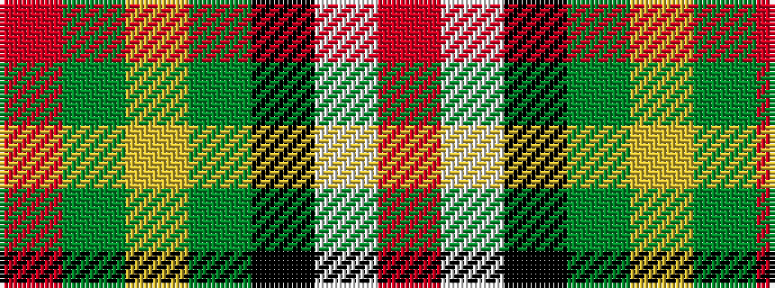

RGYGKWR

It is a 7 stripe tartan.

<figure class="pat-woven">

<figcaption>idealised sample</figcaption>
</figure>

## Colour Sequence



## Tartans with this colour sequence

| Tartans |
|---------------|
| [Ferguson the Astronomer](/variants/s7/r48w3k3g2ly6g2r6~x4/)|
||
